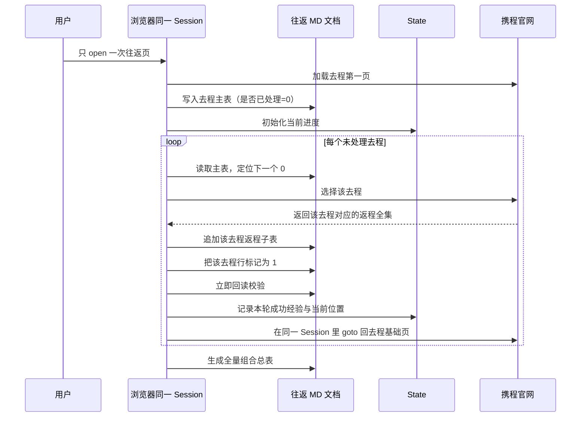

# 携程往返：去程整页打标迭代抓返程 SOP

适用场景：用户要拿到**往返模式下第一页所有去程**，并且要求对每一个去程都继续进入返程页，把该去程对应的**全部返程组合**逐一收集下来。

这个 SOP 的核心不是一次性“直接拿到 `N × N`”，而是先把去程页固化成一个**带处理标记的主表**，然后按行迭代。

## Mermaid 时序图



## Session 原则

- **只 open 一次**，后续全程复用同一个 `session id` 和同一个 `profile`。
- **不要 close**，也不要每处理一个去程就新开浏览器。
- 每一轮 loop 结束后，回到去程页时，应该在**同一个 session** 内执行一次 `goto` 回基础 URL，而不是重新 `open`。
- 复用的是登录态、cookie、profile、风控上下文；重置的是当前页面内容。
- 同一个 session 必须**串行处理**，不要并行点多个去程，否则页面状态会乱。

## State 原则

- 每完成一个最小单元（一个去程 + 该去程全部返程），就要立刻更新一次 `state`。
- `state` 至少要记录：
  - 已固化的去程主表快照
  - 当前处理到的去程序号
  - 已处理去程集合
  - 最近一次成功抓取的返程组合数
  - 最近一次成功经验（例如：本轮必须先 `goto` 回基础页）
- `state` 的作用不是展示结果，而是保证中断后能继续，不依赖聊天上下文记忆。

## 核心思路

1. 先把往返模式下第一页的**全部去程**整理成主表。
2. 在主表最后加一列：`是否已处理`。
3. 每处理完一个去程，就把这一行标成 `1`。
4. 每处理完一个去程，就立刻把本轮成功经验写入 `state`。
5. 然后在**同一个 session** 里 `goto` 回去程基础页，找到下一个还没打标的去程，继续处理。
6. 循环直到这一页所有去程都被标成 `1`。

这样做的好处是：

- 可以明确知道当前处理到哪一行
- 浏览器中断、验证码、手动登录后都能恢复
- 输出文档天然分成“去程主表 + 每个去程的返程子表”
- 最后再把所有子表拼成完整 `N × N` 往返组合全集

## 输出 MD 格式要求

这类迭代任务的结果文档，建议固定成下面的层次，避免后续越写越乱：

1. 文档标题与查询元信息
2. **顶部进度摘要**（放在前面，方便一眼定位）
3. 去程主表
4. 每个去程对应的返程子表
5. 全量组合总表

### 顶部进度摘要必须前置

不要把“当前处理到第几个去程、已完成多少条”放到文档最下面。

正确做法是：放在标题区后、主表前。这样每次重新打开文档时，第一眼就知道：

- 当前处理到第几个去程
- 总共有多少个去程
- 还剩多少个没处理
- 当前已经累计了多少个往返组合

建议写成这种格式：

```markdown
## 当前进度

- 当前已处理去程：`6 / 18`
- 当前处理到：`去程 6 / ZH307`
- 当前累计返程组合：`183`
- 当前 session 策略：`单 session 复用，不 close；每轮结束后 goto 回基础页`
```

### 推荐完整结构

这里最重要的要求是：**把进度信息放在文档顶部，而不是放在最下面的说明区。**

原因很简单：

- 每一轮 loop 都会重新打开或回读这个文档
- 顶部进度摘要能让操作者立刻知道“当前做到哪里”
- 不需要滚到文档最底部再找状态
- 更适合中断恢复和人工接力

```markdown
# 携程往返全量抓取：第一页去程逐一展开返程

> 抓取时间：{时间}
> 官网：`https://flights.ctrip.com/`
> 查询条件：往返｜{出发地} → {目的地}｜去程 `{日期}`｜返程 `{日期}`｜{人数} 成人

## 当前进度

- 当前已处理去程：`X / N`
- 当前处理到：`去程 k / 航班号`
- 当前累计返程组合：`Y`
- 当前策略：`单 session 复用；每轮回基础页；每轮回写并回读 MD`

## 执行备注

- 本轮完成后立即更新主表中的 `是否已处理`
- 本轮完成后立即更新 `state`
- 本轮完成后立即回读当前 MD

## 去程主表

| 序号 | 航空公司 | 航班号/机型 | 出发时间 | 到达时间 | 出发机场 | 到达机场 | 时长 | 去程卡片价 | 对应返程数 | 是否已处理 |
|---|---|---|---|---|---|---|---|---|---|---|

## 去程 1：{去程航班} 对应的全部返程

| 序号 | 去程航班 | 返程航空公司 | 返程航班号 | 返程机型 | 返程出发 | 返程到达 | 返程出发机场 | 返程到达机场 | 中转 | 经停 | 返程时长 | 往返最低含税价 | 最低票面价 | 最低税费 | 舱位 | 价格选项数 |
|---|---|---|---|---|---|---|---|---|---|---|---|---|---|---|---|---|

## 去程 2：{去程航班} 对应的全部返程

| ... |

## 全量组合总表

| 序号 | 去程序号 | 去程航班 | 返程航空公司 | 返程航班号 | 返程出发 | 返程到达 | 返程出发机场 | 返程到达机场 | 中转 | 经停 | 返程时长 | 往返最低含税价 | 舱位 | 价格选项数 |
|---|---|---|---|---|---|---|---|---|---|---|---|---|---|---|
```

### 字段要求

#### 去程主表字段

- `序号`：当前第一页去程顺序
- `航空公司`
- `航班号/机型`
- `出发时间` / `到达时间`
- `出发机场` / `到达机场`
- `时长`
- `去程卡片价`
- `对应返程数`：该去程已经抓到多少条返程组合
- `是否已处理`：未处理填 `0`，完成后改 `1`

#### 返程子表字段

- `序号`
- `去程航班`
- `返程航空公司`
- `返程航班号`
- `返程机型`
- `返程出发` / `返程到达`
- `返程出发机场` / `返程到达机场`
- `中转` / `经停`
- `返程时长`
- `往返最低含税价`
- `最低票面价`
- `最低税费`
- `舱位`
- `价格选项数`

#### 全量组合总表字段

- 用来把所有去程子表拍平，方便最终检索和排序
- 至少保留：`去程序号`、`去程航班`、`返程航班号`、`往返最低含税价`

### 不推荐的格式

不要把下面这种信息只放在文档末尾：

- 当前做到第几个去程
- 当前已处理多少条
- 当前累计返程组合数

这些都应该前移到顶部 `## 当前进度`，因为它们本质上是“执行导航信息”，不是“收尾说明”。

## 最小化对象

这个 SOP 里有两个最小对象：

- **对象 A：去程主表中的一行**
- **对象 B：该去程对应的返程全集子表**

完整流程只是不断重复：

`未处理去程行 → 选中该去程 → 拉返程全集 → 回填标记 → 下一个未处理去程`

## 操作步骤

### 第 1 步：先固化去程整页

1. 打开携程往返结果页。
2. 等第一页去程列表稳定加载。
3. 如有必要，下拉页面，让第一页当前可见的去程全部渲染出来。
4. 先不要急着点返程，先把当前页所有去程提取出来，整理成一个 Markdown 主表。
5. 主表最后必须有一列：`是否已处理`，初始值都填 `0`。

建议主表字段：

- 序号
- 航空公司
- 航班号
- 机型
- 出发时间
- 到达时间
- 出发机场
- 到达机场
- 时长
- 去程卡片价
- 是否已处理

示例：

```markdown
## 去程主表

| 序号 | 航空公司 | 航班号 | 机型 | 出发时间 | 到达时间 | 出发机场 | 到达机场 | 时长 | 去程卡片价 | 是否已处理 |
|---|---|---|---|---|---|---|---|---|---|---|
| 1 | 深圳航空 | ZH305 | 空客320(中) | 00:15 | 02:15 | 宝安国际机场 T3 | 素万那普国际机场 | 3小时 | ¥3610起往返含税价 | 0 |
| 2 | 南方航空 | CZ8075 | 空客321(中) | 08:55 | 11:20 | 宝安国际机场 T3 | 素万那普国际机场 T1 | 3小时25分 | ¥3610起往返含税价 | 0 |
```

### 第 2 步：处理一个去程

1. 从主表里找到第一条 `是否已处理 = 0` 的行。
2. 在页面上选择这一条去程，点击 `选为去程`。
3. 等返程页加载完成。
4. 优先读取该返程阶段的 `routeSearch` 响应。
5. 把这个去程对应的全部返程组合整理成一个子表。
6. 子表写完后，回到主表，把这一条去程的 `是否已处理` 改成 `1`。
7. 立刻更新 `state`，写入本轮成功经验。
8. 立刻回读 MD，确认这一轮已经成功落盘。

## 第 3 步：返程子表的整理方式

每处理一个去程，都单独生成一个“返程全集子表”。

建议字段：

- 序号
- 去程航班
- 返程航空公司
- 返程航班号
- 返程机型
- 返程出发时间
- 返程到达时间
- 返程出发机场
- 返程到达机场
- 中转
- 经停
- 返程时长
- 往返最低含税价
- 最低票面价
- 最低税费
- 舱位
- 价格选项数

示例：

```markdown
## 去程 1：ZH305 对应的全部返程

| 序号 | 去程航班 | 返程航空公司 | 返程航班号 | 返程机型 | 返程出发 | 返程到达 | 返程出发机场 | 返程到达机场 | 中转 | 经停 | 返程时长 | 往返最低含税价 | 最低票面价 | 最低税费 | 舱位 | 价格选项数 |
|---|---|---|---|---|---|---|---|---|---|---|---|---|---|---|---|---|
```

## 第 4 步：切回去程页继续下一个

1. 返程子表写完后，不要新开 session。
2. 在**同一个 session** 中，直接 `goto` 回往返基础页。
3. 依据主表里的 `是否已处理` 列确认当前处理进度。
4. 读取 `state`，确认上一个 loop 的成功经验和当前位置。
5. 找到下一个 `0` 的去程行。
6. 重复“选去程 → 抓返程全集 → 回填标记 → 更新 state → 回读 MD → goto 回基础页”的流程。

这一步非常关键：**主表不是结果展示而已，它同时也是执行进度控制器。**

`state` 也同样关键：**state 不是多余记录，而是 loop 恢复器。**

## 什么时候结束

当去程主表中所有行都满足：

- `是否已处理 = 1`

说明这一页所有去程都已经展开过一次，对应的返程全集也都抓完了。

此时你会得到：

- 1 张去程主表
- N 张返程子表（每个去程 1 张）

最后再把所有返程子表拍平成一个总表，就得到用户想要的全量往返组合结果。

## 推荐文档结构

```markdown
# 携程往返全量抓取：去程逐一展开返程

## 当前进度

- 当前已处理去程：`X / N`
- 当前处理到：`去程 k / 航班号`
- 当前累计返程组合：`Y`

## 执行备注

- 本轮完成后已更新主表与 state
- 下一轮将从下一个 `是否已处理 = 0` 的去程继续

## 去程主表

| ... | 是否已处理 |

## 去程 1：{去程航班} 对应的全部返程

| ... |

## 去程 2：{去程航班} 对应的全部返程

| ... |

## 全量组合总表

| ... |
```

## 关键判断

- **返程页能看到内容，但组合抓不全**：优先检查 `routeSearch` 是否完整返回。
- **处理到一半中断**：回到主表，按 `是否已处理` 从下一个 `0` 继续。
- **处理到一半中断且浏览器还活着**：优先复用原 session，先读 `state` 再继续。
- **回到去程页后找不到之前的位置**：主表就是进度锚点，不依赖聊天记忆。
- **每轮都重新 open / close**：这是反模式，会丢登录态并增加风控；应该改为单 session + 每轮 `goto` 回基础页。
- **主表和实际页面顺序不一致**：优先以航班号 + 时间做定位，不只靠序号。

## 为什么这个 SOP 稳定

因为它把“大任务”拆成了很多个可恢复的小任务：

- 先存去程主表
- 每次只处理一个去程
- 每处理完一条就落盘并打标
- 每处理完一条就更新 `state`
- 每处理完一条都回到基础页，但不丢 session

即使页面刷新、浏览器断开、用户中途登录、验证码打断，也不会丢掉整体进度。
