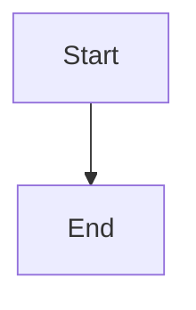

# Obsidian Markdown

当 `obsidian-tools` 需要创建或编辑 Obsidian 笔记正文格式时，优先参考本文件。

## 目标

编写合法的 Obsidian Flavored Markdown，重点覆盖：

- frontmatter properties
- wikilinks
- embeds
- callouts
- tags
- comments
- Obsidian 特有语法

## 基本工作流

1. 先写 frontmatter
2. 用标准 Markdown 组织正文
3. 内部链接优先用 `[[wikilinks]]`
4. 外部链接用 `[text](url)`
5. 需要强调时使用 callouts
6. 写完后保证在 Obsidian 中可正确渲染

## 常用语法

### Wikilinks

```markdown
[[Note Name]]
[[Note Name|Display Text]]
[[Note Name#Heading]]
[[Note Name#^block-id]]
```

### Embeds

```markdown
![[Note Name]]
![[Note Name#Heading]]
![[image.png|300]]
![[document.pdf#page=3]]
```

### Callouts

```markdown
> [!note]
> Basic callout.

> [!warning] Custom Title
> Warning content.
```

常见类型：`note`、`tip`、`warning`、`info`、`example`、`quote`、`bug`、`danger`、`success`、`failure`、`question`、`abstract`、`todo`

### Frontmatter

```yaml
---
title: My Note
tags:
  - project
aliases:
  - Alternative Name
cssclasses:
  - custom-class
---
```

### Tags

```markdown
#tag
#nested/tag
```

### Comments

```markdown
This is visible %%but this is hidden%% text.
```

### Highlight / Math / Mermaid / Footnotes

```markdown
==Highlighted==
$e^{i\pi} + 1 = 0$
[^1]
```



## 约束

- Vault 内部笔记优先使用 `[[wikilinks]]`
- 外链优先使用标准 Markdown link
- frontmatter 字段名保持稳定，不随意发明新字段
- 与 `references/note-format.md` 冲突时，以 `note-format.md` 的领域格式为准
